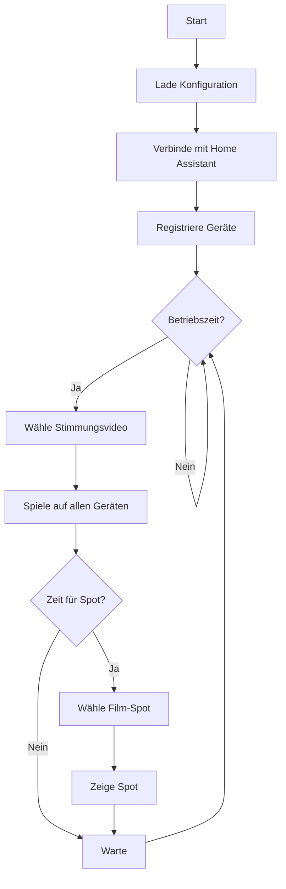

# 🎃 Halloween 2025 - Immich Kiosk Loader

Einfaches Tool zum Laden von Immich Kiosk auf allen Fire TV und Fully Kiosk Browser Geräten.

## 📋 Übersicht

Zeigt Immich Kiosk (`kiosk.fkainka.de`) auf allen konfigurierten Geräten:
- **Fire TV**: Mit automatischem Fullscreen (2x Menu-Taste)
- **Fully Kiosk Tablets**: Mit Vollbild-Unterstützung

Perfekt für Halloween-Bildershows!

## 🎯 Features

- ✅ Fire TV Support mit automatischem Fullscreen
- ✅ Fully Kiosk Browser Support
- ✅ Auto-Discovery aller Geräte aus Home Assistant
- ✅ URL-Parameter anpassbar
- ✅ Einfache Konfiguration über `config.yaml`

## 🔧 Voraussetzungen

### Home Assistant
- Home Assistant Installation
- Long-lived Access Token

### Fire TV
- Fire TV Geräte in Home Assistant integriert (androidtv Integration)
- **ADB aktiviert** (siehe [ADB auf Fire TV aktivieren](#adb-auf-fire-tv-aktivieren))

### Fully Kiosk Browser
- Fully Kiosk Browser Plus auf Android Tablets
- REST API aktiviert (Settings → Advanced Web Settings → Enable Remote Admin)
- Password konfiguriert

## 📦 Installation

### 1. Python Dependencies installieren

```bash
pip install -r requirements.txt
```

### 2. Home Assistant Token erstellen

1. In Home Assistant einloggen
2. Klicke auf dein Profil (unten links)
3. Scrolle nach unten zu **"Long-Lived Access Tokens"**
4. Klicke auf **"Create Token"**
5. Gib einen Namen ein (z.B. "Halloween Kiosk")
6. Kopiere den Token in `config.yaml`

### 3. ADB auf Fire TV aktivieren

**Für jeden Fire TV Stick/Fire TV:**

1. **Developer Options aktivieren:**
   - Gehe zu **Settings** (Einstellungen)
   - Wähle **My Fire TV** (Mein Fire TV)
   - Wähle **About** (Info)
   - Klicke **7x auf "Serial Number"** (Seriennummer)
   - Eine Meldung erscheint: "You are now a developer"

2. **ADB Debugging aktivieren:**
   - Gehe zurück zu **My Fire TV**
   - Wähle **Developer Options** (Entwickleroptionen)
   - Aktiviere **ADB Debugging** (Schalter auf ON)
   - Bestätige die Sicherheitswarnung

3. **Fire TV in Home Assistant integrieren:**
   - Öffne Home Assistant
   - Gehe zu **Settings** → **Devices & Services**
   - Klicke **+ Add Integration**
   - Suche nach **"Android TV"** oder **"Android Debug Bridge"**
   - Gib die IP-Adresse des Fire TV ein
   - Bestätige die Verbindung auf dem Fire TV Screen

**Hinweis:** ADB muss auf jedem Fire TV einzeln aktiviert werden!

### 4. Auto-Discovery ausführen

```bash
python auto_discover.py
```

Findet automatisch alle Fire TV Geräte und fügt sie zur Config hinzu.

### 5. Konfiguration anpassen

Bearbeite `config.yaml`:

```yaml
home_assistant:
  url: "http://192.168.1.100:8123"  # Deine Home Assistant URL
  token: "eyJ0eXAiOiJKV1QiLC..."     # Dein Token

# Film-Spots werden automatisch aus universen.yaml geladen
universen_yaml_path: "../notes/universen.yaml"
```

## 🔑 Home Assistant Token erstellen

1. In Home Assistant einloggen
2. Klicke auf dein Profil (unten links)
3. Scrolle nach unten zu **"Long-Lived Access Tokens"**
pip install -r requirements.txt
```

### 2. Konfiguration anpassen

Bearbeite `config.yaml`:

```yaml
immich_kiosk:
  base_url: "https://kiosk.fkainka.de"
  params:
    # refresh: 60  # Optional: Sekunden zwischen Bildern

fire_tv_devices:
  - entity_id: "media_player.wohnzimmer_fire_tv"
    name: "Wohnzimmer Fire TV"

fully_kiosk_devices:
  - name: "Tablet Eingang"
    ip: "192.168.178.56"
    password: "duckya"
```

## 🚀 Verwendung

### Alle Geräte laden

```bash
python simple_kiosk.py
```

Lädt Immich Kiosk auf:
- ✅ Alle Fire TV Geräte (mit automatischem Fullscreen)
- ✅ Alle Fully Kiosk Tablets

### Auto-Discovery

```bash
python auto_discover.py
```

Findet automatisch alle Fire TV und Fully Kiosk Geräte aus Home Assistant.

### IP-Adressen finden

```bash
python find_tablet_ips.py
```

Sucht nach IP-Adressen der Fully Kiosk Tablets.

## ⚙️ URL-Parameter

Häufige Immich Kiosk Parameter:

- `refresh`: Sekunden zwischen Bildern (z.B. `60`)
- `asset-type`: `IMAGE`, `VIDEO` oder beide
- `album`: Album-ID zum Anzeigen

Beispiel in `config.yaml`:
```yaml
immich_kiosk:
  base_url: "https://kiosk.fkainka.de"
  params:
    refresh: 30
    asset-type: "IMAGE"
```

## 🔧 Troubleshooting

### Fire TV Probleme

**Fire TV wird nicht gefunden:**
1. Prüfe ob Fire TV in Home Assistant integriert ist
2. Gehe zu Settings → Devices & Services → Suche "Android TV"
3. ADB muss aktiviert sein (siehe [ADB aktivieren](#adb-auf-fire-tv-aktivieren))

**Fire TV Fullscreen funktioniert nicht:**
1. Teste manuell: Drücke 2x die Menu-Taste auf der Fernbedienung
2. Falls anderer Keycode benötigt wird: `python test_keycodes.py`
3. Passe Wartezeit in `simple_kiosk.py` an (Zeile mit `time.sleep(3)`)

**ADB Connection refused:**
1. Fire TV neustarten
2. ADB in Developer Options erneut aktivieren
3. Fire TV aus Home Assistant entfernen und neu hinzufügen

### Fully Kiosk Probleme

**Tablet nicht erreichbar:**
- Prüfe ob Fully Kiosk Browser läuft
- Prüfe IP-Adresse und Port 2323
- Prüfe "Remote Admin" in Fully Kiosk Settings aktiviert ist
- Prüfe korrektes Passwort

**URL wird nicht geladen:**
- Teste URL im Browser
- Prüfe Fully Kiosk Log
- Teste mit einfacher URL (ohne Parameter)

### IP-Adressen finden

**Fully Kiosk Tablets:**
1. Öffne Fully Kiosk App auf dem Tablet
2. Settings → Advanced Web Settings
3. Bei "Remote Admin (IP)" steht die IP-Adresse

**Fire TV:**
1. Settings → My Fire TV → About → Network
2. Oder im Router unter verbundene Geräte suchen

## 📝 Beispiele

### Einfache URL ohne Parameter
```yaml
immich_kiosk:
  base_url: "https://kiosk.fkainka.de"
```

### Mit Refresh-Parameter
```yaml
immich_kiosk:
  base_url: "https://kiosk.fkainka.de"
  params:
    refresh: 45
```

### Mit mehreren Parametern
```yaml
immich_kiosk:
  base_url: "https://kiosk.fkainka.de"
  params:
    refresh: 30
    asset-type: "IMAGE"
```
nssm install Halloween25MediaController "C:\Python\python.exe" "C:\Projekte\Halloween25\media_controller\main.py"
nssm start Halloween25MediaController
```

## 📊 Logging & Monitoring

### Log-Dateien

Logs werden gespeichert in:
```
logs/media_controller.log
```

### Statistiken

Alle 5 Minuten werden Statistiken ausgegeben:
- Anzahl gespielter Stimmungsvideos
- Anzahl gespielter Film-Spots
- Status jedes Geräts
- Letzter Spot-Zeitpunkt

### Live-Monitoring

```bash
# Windows PowerShell
Get-Content logs\media_controller.log -Wait -Tail 20

# CMD
type logs\media_controller.log
```

## 🐛 Troubleshooting

### Problem: "Home Assistant Verbindung fehlgeschlagen"

**Lösung:**
1. Prüfe die URL in `config.yaml`
2. Teste im Browser: `http://DEINE_IP:8123`
3. Prüfe ob der Token noch gültig ist

### Problem: "Fire TV reagiert nicht"

**Lösung:**
1. Prüfe ob Fire TV in Home Assistant verfügbar ist
2. Developer Tools → States → Suche nach `media_player.fire_tv_*`
3. ADB-Verbindung testen

### Problem: "Fully Kiosk lädt keine URLs"

**Lösung:**
1. Prüfe Remote Admin Password
2. Teste manuell: `http://TABLET_IP:2323/?cmd=loadURL&url=https://google.com&password=DEIN_PASSWORD`
3. Firewall-Einstellungen prüfen

### Problem: "Keine Film-Spots werden abgespielt"

**Lösung:**
1. Erhöhe `spot_probability` in `config.yaml`
2. Verringere `min_spot_interval`
3. Prüfe Logs für Fehlermeldungen

## 📁 Projektstruktur

```
media_controller/
├── main.py                      # Hauptprogramm
├── home_assistant_client.py     # Home Assistant API Client
├── media_manager.py             # Media-Logik und Zeitsteuerung
├── config.yaml                  # Konfiguration
├── requirements.txt             # Python Dependencies
├── README.md                    # Diese Datei
└── logs/
    └── media_controller.log     # Log-Dateien
```

## 🔄 Workflow



## 🎨 Anpassungen

### Eigene Stimmungsvideos hinzufügen

Bearbeite `config.yaml`:

```yaml
ambient_videos:
  - name: "Mein Video"
    url: "https://www.youtube.com/watch?v=XXXXX"
    duration: 900
    weight: 1
```

### Film-Spots hinzufügen

**Film-Spots werden automatisch aus `universen.yaml` geladen!**

Die Datei `notes/universen.yaml` enthält alle Filme mit:
- Film-Clips (YouTube URLs)
- Team IDs
- Charaktere
- Easter Eggs
- Puzzle-Links

**Keine manuelle Konfiguration in `config.yaml` nötig!**

Um neue Filme hinzuzufügen, bearbeite `notes/universen.yaml`:

```yaml
universes:
  - title: "Mein Film"
    characters:
      - name: "Charakter1"
        id: "123456"
      - name: "Charakter2"
        id: "234567"
    team_id: "358023"
    film_clip: "https://www.youtube.com/watch?v=XXXXX"
    puzzle_link: "https://www.jigsawplanet.com/?rc=play&pid=..."
```

**Test:** Führe `python test_universen.py` aus, um die geladenen Film-Spots zu prüfen.

### Nur bestimmte Geräte verwenden

Kommentiere unerwünschte Geräte aus:

```yaml
fire_tv_devices:
  - entity_id: "media_player.fire_tv_wohnzimmer"
    name: "Wohnzimmer"
  # - entity_id: "media_player.fire_tv_kueche"
  #   name: "Küche"
```

## 📝 Lizenz

Dieses Projekt ist für private Halloween-Events entwickelt.

## 🤝 Support

Bei Fragen oder Problemen:
1. Prüfe die Log-Dateien
2. Aktiviere DEBUG-Logging in `config.yaml`
3. Teste einzelne Komponenten manuell

## 🎃 Viel Erfolg bei deiner Halloween-Party! 🎃
