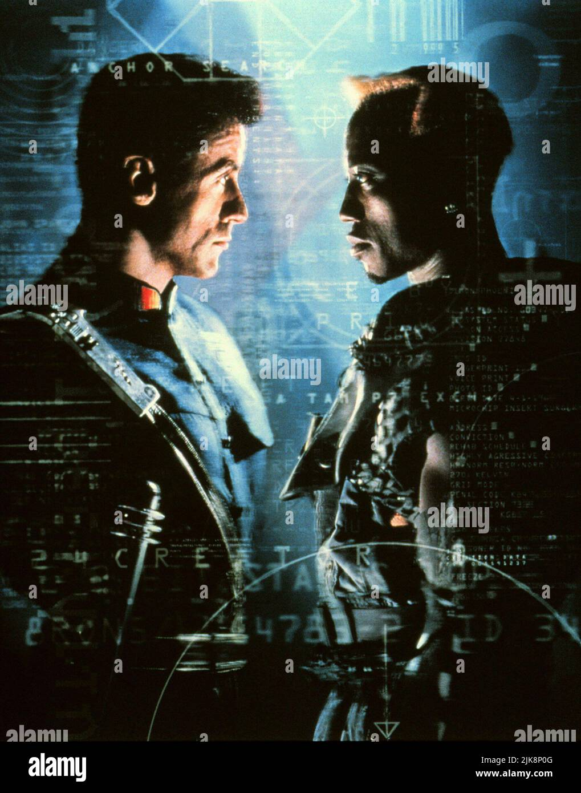
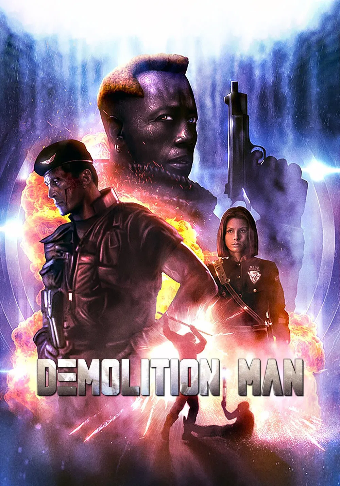
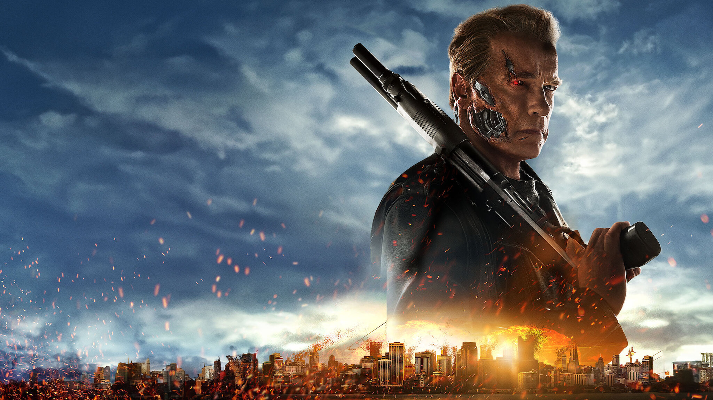
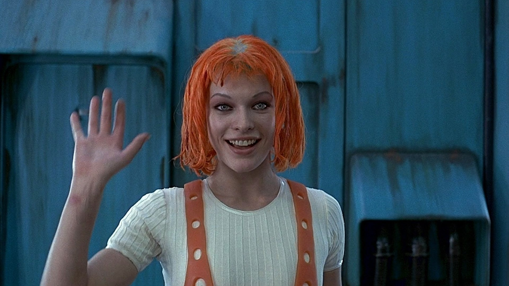

# Notizen:
- Es gibt 15 Filme bzw. Referenzen.
- Jeder Film enthält ein Easter Egg, einen Filmausschnitt, ein Plakat und einen Puzzle-Link.
- Puzzle-Links stammen meist von Jigsaw Planet und sind auf 24–25 Teile begrenzt (wählbar).
- Filmausschnitte sind überwiegend von YouTube und möglichst kurz gehalten (max. 2–3 Minuten).
- Plakate werden aus dem Internet (Google Bildersuche, hohe Auflösung!) bezogen. Der Filmtitel sollte, wenn möglich, entfernt oder beschnitten werden.
- Easter Eggs: Sie sollen leicht erkennbar, gut sichtbar und möglichst in einer Szene platziert sein, die an den jeweiligen Film erinnert. Dazu gibt es eine Beschreibung und – wenn möglich – ein Beispielbild (Google Bildersuche).
- Charaktere: Zwei Hauptcharaktere mit Namen. Jeder Charakter erhält eine sechsstellige ID. Die TeamID ist ebenfalls sechsstellige und ergibt sich aus der Summe der einzelnen Charakter-IDs.

---

# Universen/Referenzen (Fertiggeplant: 22):

## Matrix
- **Charaktere:**
  - Trinity, Neo
  - IDs: 246935, 233579
  - TeamID: 480514
- **Easter Egg:** Blaue und Rote Pille
  - **Beschreibung:** Eine rote und blaue Pille, die prominent platziert werden. Idealerweise soll hier die Szene mit Morpheus und Neo nachgestellt werden, in der Morpheus Neo die Wahl zwischen der roten und blauen Pille anbietet.
  - **Beispielbild:** 
- **Filmausschnitt:** [Matrix Szene](https://youtu.be/CWIfwZ99AVA?si=nrqu70hBEvESXYdl&t=215)
- **Puzzle Link:** [Matrix Puzzle Link](https://www.jigsawplanet.com/?rc=play&pid=33d524e0e905&pieces=24)

## Demolition Man
- **Charaktere:**
  - Spartan, Huxley
  - IDs: 037534, 380315
  - TeamID: 417849
- **Easter Egg:** Drei Muscheln
  - **Beschreibung:** Drei Muscheln werden anstelle von Toilettenpapier benutzt. Es sollen 3 Muscheln in einem Badezimmer platziert werden, idealerweise in einer Szene, die an das Original erinnert.
  - **Beispielbild:** 
- **Filmausschnitt:** [Demolition Man Szene](https://www.youtube.com/watch?v=imv7g7akeok)
- **Puzzle Link:** [Demolition Man Puzzle Link](https://www.jigsawplanet.com/?rc=play&pid=3494319d2445&pieces=24)
- **Plakate:**
  - 
  - 
  - 

## Terminator
- **Charaktere:**
  - Sarah, John
  - IDs: 213642, 012573
  - TeamID: 226215
- **Easter Egg:** Totenkopf mit roten LED-Augen
  - **Beschreibung:** Ein Totenkopf mit leuchtend roten LED-Augen, der an den Terminator erinnert.
  - **Beispielbild:** 
- **Filmausschnitt:** [Terminator Szene](https://www.youtube.com/watch?v=XPtVZ69lomk)
- **Puzzle Link:** [Terminator Puzzle Link](https://www.jigsawplanet.com/?rc=play&pid=09f7d810363c&pieces=24)
- **Plakate:**
  - 
  - 

## The Fifth Element
- **Charaktere:**
  - Leeloo, Korben
  - IDs: 205251, 259951
  - TeamID: 465202
- **Easter Egg:** Element Steine
  - **Beschreibung:** Symbolisieren die Einheit der Elemente gegen das Böse.
  - **Beispielbild:** 
- **Filmausschnitt:** [The Fifth Element Szene](https://www.youtube.com/watch?v=jjE30P8Hf9E)
- **Puzzle Link:** [The Fifth Element Puzzle Link](https://www.jigsawplanet.com/?rc=play&pid=26d27f5d2bd2&pieces=25)
- **Plakate:**
  - 

## V wie Vendetta
- **Charaktere:**
  - V, Evey
  - IDs: 462487, 280235
  - TeamID: 742722
- **Easter Egg:** Guy Fawkes Maske

## Blade Runner
- **Charaktere:**
  - Rick, Rachael
  - IDs: 129864, 137712
  - TeamID: 267576
- **Easter Egg:** Origami Einhorn

## Gattaca
- **Charaktere:**
  - Vincent, Irene
  - IDs: 395627, 313788
  - TeamID: 709415
- **Easter Egg:** Blut auf der Tastatur
  - **Beschreibung:** Liebe und Täuschung in einer genetischen Welt.

## In Time
- **Easter Egg:** Leuchtende Zeit-Tattoos
  - **Beschreibung:** Verknüpfen Lebenserwartung und soziale Klasse.

## Wanted
- **Charaktere:**
  - Wesley, Fox
  - IDs: 328023, 488289
  - TeamID: 816312
- **Easter Egg:** Gebogene Kugel

## Ex Machina
- **Charaktere:**
  - Caleb, Ava
  - IDs: 438087, 351091
  - TeamID: 789178
- **Easter Egg:** Spiegelnde Glaswände
  - **Beschreibung:** Verdeutlichen Selbsttäuschung und Projektion.

## Genesis Backup [ DAS SIND Einfach wir, checkt sonst keiner]
- **Charaktere:**
  - William, Feng
  - IDs: 290481, 231612
  - TeamID: 522093
- **Easter Egg:** Grüner Stein
----

## Starship Troopers
- **Charaktere:**
  - Rico, Dizzy
  - IDs: 252571, 354638
  - TeamID: 607209
- **Easter Egg:** Bug-Kopf
  - **Beschreibung:** Ein Modell oder Bild eines Bug-Kopfes, der die außerird

## Equilibrium
- **Charaktere:**
  - Preston, Mary
  - IDs: 141796, 454548
  - TeamID: 596344
- **Easter Egg:** Zerbrochene Glasampulle mit Prozium
  - **Beschreibung:** Steht für Emotion als Revolution.

## Robocop
- **Charaktere:**
  - Murphy, RoboCop
  - IDs: 453532, 464388
  - TeamID: 917920
- **Easter Egg:** RoboCop Helm
  - **Beschreibung:** Verkörpert die Verschmelzung von Mensch und Maschine.

## I, Robot
- **Easter Egg:** Roboter mit menschlichen Eigenschaften
  - **Beschreibung:** Thematisiert die Grenzen zwischen Mensch und Maschine.

## Mad Max Fury Road
- **Charaktere:**
  - Max, Furiosa
  - IDs: 116856, 174759
  - TeamID: 291615
- **Easter Egg:** Silbernes Chromspray
  - **Beschreibung:** Ritual der Hingabe für Freiheit.

## 2001 Odyssee im Weltraum
- **Easter Egg:** Affen

## Her
- **Charaktere:**
  - Theodore, Samantha
  - IDs: 217832, 478068
  - TeamID: 695900
- **Easter Egg:** Ohrhörer
  - **Beschreibung:** Bindeglied zwischen Realität und KI-Liebe.

## Transcendence
- **Charaktere:**
  - Dr Will Caster, Evelyn
  - IDs: 014449, 350826
  - TeamID: 365275
- **Easter Egg:** Nano Staubwolke
  - **Beschreibung:** Easter Eggisiert digitales Bewusstsein jenseits des Körpers.

## 1984
- **Charaktere:**
  - Winston, Julia
  - IDs: 394595, 200481
  - TeamID: 595076
- **Easter Egg:** Papierbotschaft Down with Big Brother
  - **Beschreibung:** Liebe als Akt der Rebellion.

## Maze Runner
- **Charaktere:**
  - Thomas, Teresa
  - IDs: 243971, 261346
  - TeamID: 505317
- **Easter Egg:** Das Labyrinth
  - **Beschreibung:** Suche nach Wahrheit in einer manipulierten Welt.

## Die Insel
- **Charaktere:**
  - Lincoln Six Echo, Jordan Two Delta
  - IDs: 102399, 350575
  - TeamID: 452974
- **Easter Egg:** Weiße Anzüge und genetische Klone
  - **Beschreibung:** Der Traum von Freiheit als Illusion.